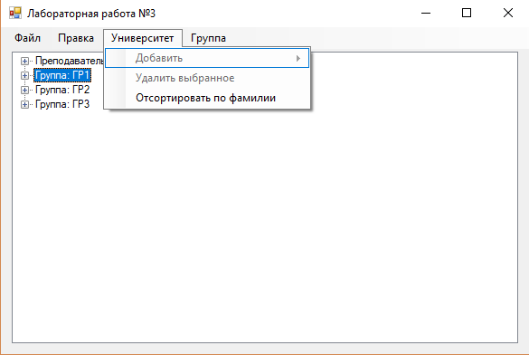
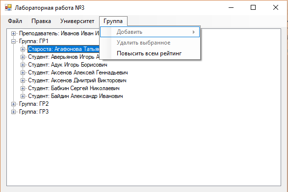
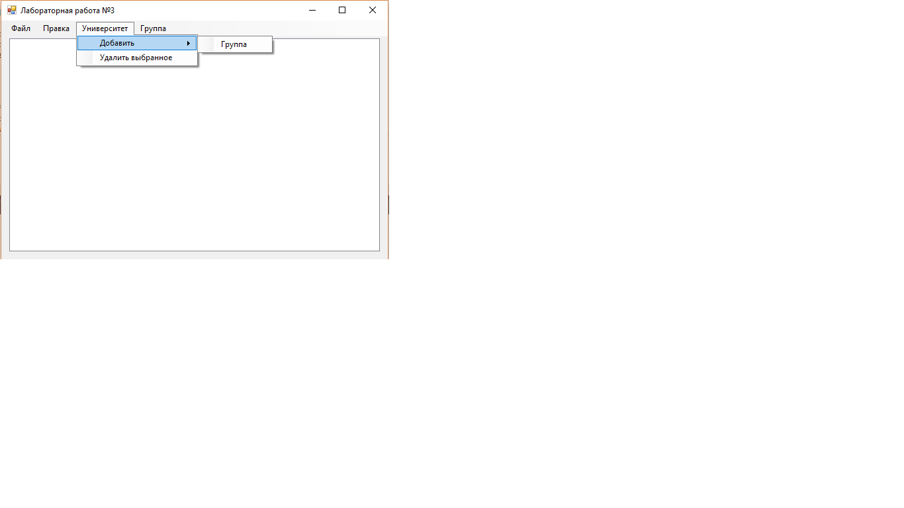
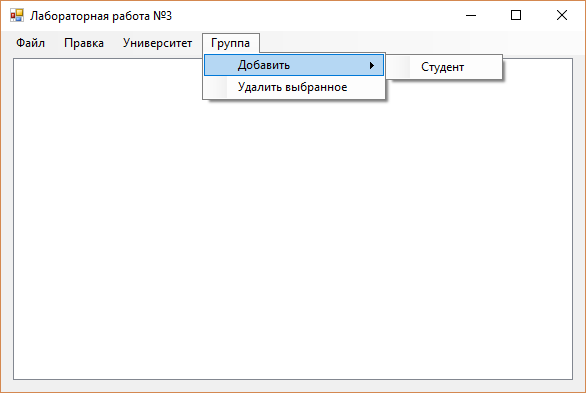
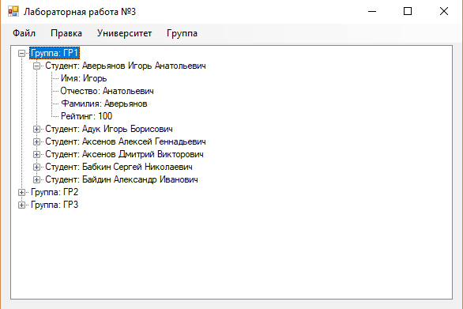
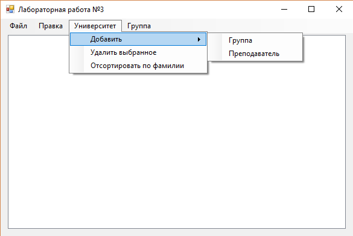
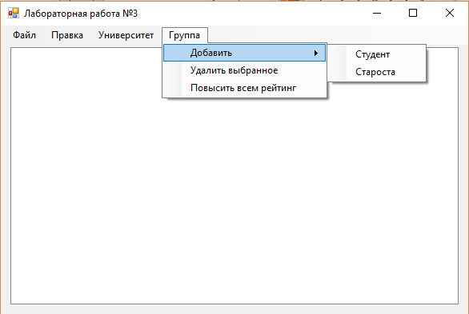
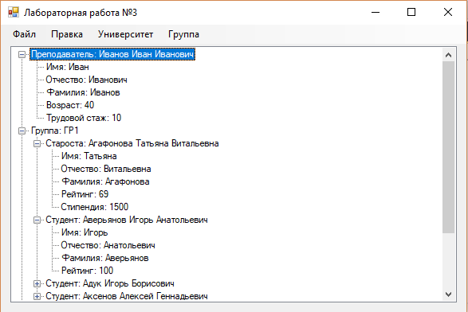

# Лабораторная работа №3

При работе без прав администратора нет возможности добавлять и удалять содержимое.

При первом запуске приложения в папке данных приложений (C:\Users\ИмяПользователя\AppData\Roaming) создается файл .ini хранящий настройки интерфейса.

При первом запуске с правами администратора данная возможность добавляется.

При работе без подключенных плагинов приложение работает только со студентами и группами.

При подключении плагинов добавляются новые возможности.

